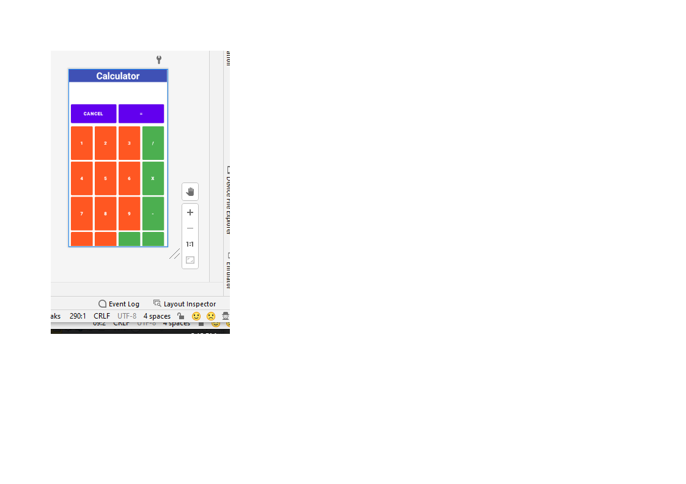
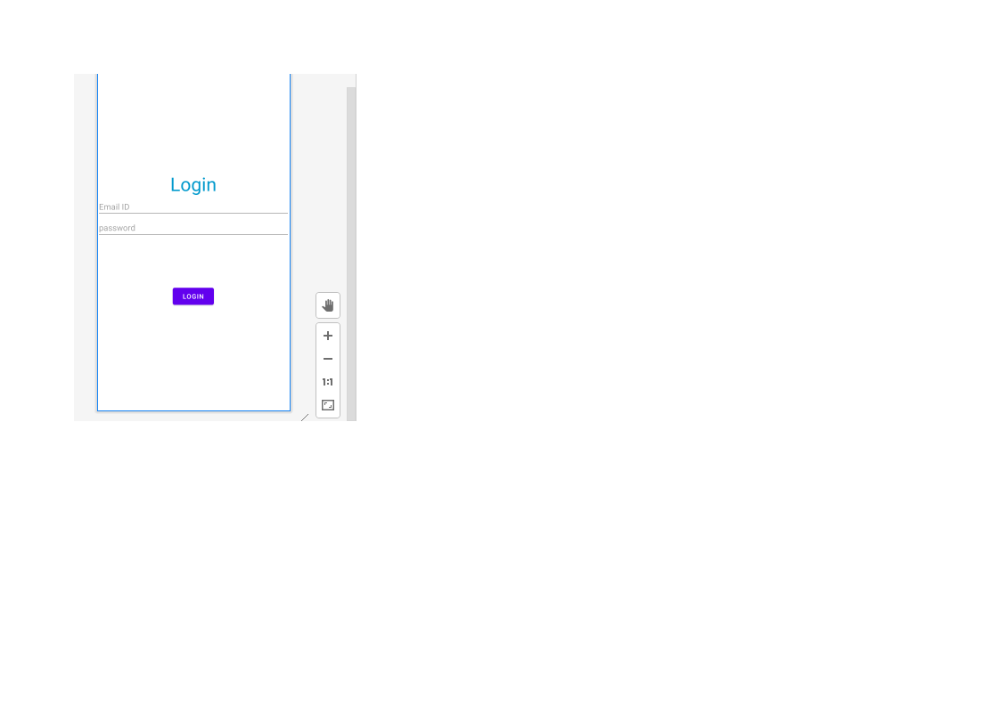

**Android Internship Report**

**Personal Details** 

Name		: 	Krina Rajvi

Enrollment No.	:	181214116010

College Name	: 	Apollo Institute of Engineering And Technology 

Degree 		: 	BE

Branch		:	Information and Technology

Semester 		: 	7

Github URL	: 	<https://github.com/krinarajvi/Summer-Internship-Project.git> 

**Company Details** 

Company Name 		: 	Akash Technolabs 

External Guide		:	Akash Padhiyar

Training Duration	:   	26-05-2021 to 07-06-2021
# **1.ACTIVITY LIFE CYCLE**

**XML FILE-**

<LinearLayout xmlns:android="http://schemas.android.com/apk/res/android"
`    `xmlns:app="http://schemas.android.com/apk/res-auto"
`    `xmlns:tools="http://schemas.android.com/tools"
`    `android:layout\_width="match\_parent"
`    `android:layout\_height="match\_parent"
`    `android:gravity="center"
`    `android:orientation="vertical"
`    `tools:context=".MainActivity">

`    `<EditText
`        `android:id="@+id/edit\_text"
`        `android:layout\_width="match\_parent"
`        `android:layout\_height="wrap\_content"
`        `android:inputType="number" />

`    `<EditText
`        `android:id="@+id/edit\_text2"
`        `android:layout\_width="match\_parent"
`        `android:layout\_height="wrap\_content"
`        `android:inputType="number" />

`    `<EditText
`        `android:id="@+id/age"
`        `android:layout\_width="match\_parent"
`        `android:layout\_height="wrap\_content" />

`    `<Button
`        `android:id="@+id/button"
`        `android:layout\_width="wrap\_content"
`        `android:layout\_height="wrap\_content"
`        `android:text="calculate" />

`    `<Button
`        `android:id="@+id/check"
`        `android:layout\_width="wrap\_content"
`        `android:layout\_height="wrap\_content"
`        `android:text="check" />

</LinearLayout>

` `JAVA ACTIVITY FILE-

public class MainActivity extends AppCompatActivity {
`   `EditText edit\_text ,edit\_text2;
`    `Button button;
`    `EditText age;
`    `Button check;

`    `@Override
`    `protected void onCreate(Bundle savedInstanceState) {
`        `super.onCreate(savedInstanceState);
`        `setContentView(R.layout.*activity\_main*);
`        `edit\_text=findViewById(R.id.*edit\_text*);
`        `edit\_text2=findViewById(R.id.*edit\_text2*);
`        `button=findViewById(R.id.*button*);
`        `age=findViewById(R.id.*age*);
`        `check=findViewById(R.id.*check*);
`        `button.setOnClickListener(new View.OnClickListener() {
`            `@Override
`            `public void onClick(View v) {
`                `int edittext1 = Integer.*parseInt*(edit\_text.getText().toString());
`                `int edittext2 = Integer.*parseInt*(edit\_text2.getText().toString());
`              `if (edittext1>edittext2){
`                  `Toast.*makeText*(MainActivity.this, edit\_text.getText().toString(), Toast.*LENGTH\_SHORT*).show();
`              `}else {
`                  `Toast.*makeText*(MainActivity.this, edit\_text2.getText().toString(), Toast.*LENGTH\_SHORT*).show();
`              `}

`            `}
`        `});
`        `check.setOnClickListener(new View.OnClickListener() {
`            `@Override
`            `public void onClick(View v) {
`                `int agenumber = Integer.*parseInt*(age.getText().toString());
`                `if (agenumber<=18){
`                    `Toast.*makeText*(MainActivity.this, "not elgible", Toast.*LENGTH\_SHORT*).show();
`                `}else{
`                    `Toast.*makeText*(MainActivity.this, "Eligible to vote", Toast.*LENGTH\_SHORT*).show();
`                `}
`            `}
`        `});
`        `Toast.*makeText*(this, "OnCreate", Toast.*LENGTH\_SHORT*).show();
`    `}

`    `@Override
`    `protected void onStart() {
`        `super.onStart();
`        `Toast.*makeText*(this, "onStart", Toast.*LENGTH\_SHORT*).show();
`    `}

`    `@Override
`    `protected void onRestart() {
`        `super.onRestart();
`        `Toast.*makeText*(this, "onRestart", Toast.*LENGTH\_SHORT*).show();
`    `}

`    `@Override
`    `protected void onResume() {
`        `super.onResume();
`        `Toast.*makeText*(this, "onResume", Toast.*LENGTH\_SHORT*).show();
`    `}

`    `@Override
`    `protected void onStop() {
`        `super.onStop();
`        `Toast.*makeText*(this, "onStop", Toast.*LENGTH\_SHORT*).show();
`    `}

`    `@Override
`    `protected void onDestroy() {
`        `super.onDestroy();
`        `Toast.*makeText*(this, "onDestroy", Toast.*LENGTH\_SHORT*).show();
`    `}

}

## **2. CALCULATOR**
**XML FILE-**

<LinearLayout xmlns:android="http://schemas.android.com/apk/res/android"
`    `xmlns:tools="http://schemas.android.com/tools"
`    `android:layout\_width="match\_parent"
`    `android:layout\_height="match\_parent"
`    `android:orientation="vertical"
`    `tools:context=".MainActivity">

`    `<TextView
`        `android:layout\_width="match\_parent"
`        `android:layout\_height="wrap\_content"
`        `android:background="#3F51B5"
`        `android:gravity="center"
`        `android:text="Calculator"
`        `android:textColor="@color/white"
`        `android:textSize="30dp"
`        `android:textStyle="bold" />

`    `<LinearLayout
`        `android:layout\_width="match\_parent"
`        `android:layout\_height="wrap\_content"
`        `android:orientation="horizontal"
`        `android:padding="10dp">

`        `<EditText
`            `android:id="@+id/editText"
`            `android:layout\_width="wrap\_content"
`            `android:layout\_height="wrap\_content"
`            `android:layout\_weight="1"
`            `android:backgroundTint="#FFFFFF"
`            `android:inputType="number" />

`    `</LinearLayout>

`    `<LinearLayout
`        `android:layout\_width="match\_parent"
`        `android:layout\_height="72dp"
`        `android:layout\_marginStart="5dp"
`        `android:layout\_marginEnd="5dp"
`        `android:orientation="horizontal">

`        `<Button
`            `android:id="@+id/buttonCancel"
`            `android:layout\_width="0dp"
`            `android:layout\_height="match\_parent"
`            `android:layout\_marginStart="2dp"
`            `android:layout\_marginEnd="4dp"
`            `android:layout\_weight="1"
`            `android:text="cancel"
`            `android:textStyle="bold"/>

`        `<Button
`            `android:id="@+id/buttonEqual"
`            `android:layout\_width="0dp"
`            `android:layout\_height="match\_parent"
`            `android:layout\_marginStart="2dp"
`            `android:layout\_marginEnd="4dp"
`            `android:layout\_weight="1"
`            `android:textStyle="bold"
`            `android:text="=" />

`    `</LinearLayout>

`    `<LinearLayout
`        `android:layout\_width="match\_parent"
`        `android:layout\_height="115dp"
`        `android:layout\_marginStart="5dp"
`        `android:layout\_marginEnd="5dp"
`        `android:orientation="horizontal">

`        `<Button
`            `android:id="@+id/button1"
`            `android:layout\_width="0dp"
`            `android:layout\_height="120dp"
`            `android:layout\_marginStart="2dp"
`            `android:layout\_marginEnd="4dp"
`            `android:layout\_weight="1"
`            `android:backgroundTint="#FF5722"
`            `android:text="1"
`            `android:textStyle="bold" />

`        `<Button
`            `android:id="@+id/button2"
`            `android:layout\_width="0dp"
`            `android:layout\_height="120dp"
`            `android:layout\_marginStart="2dp"
`            `android:layout\_marginEnd="4dp"
`            `android:layout\_weight="1"
`            `android:backgroundTint="#FF5722"
`            `android:text="2"
`            `android:textStyle="bold" />

`        `<Button
`            `android:id="@+id/button3"
`            `android:layout\_width="0dp"
`            `android:layout\_height="120dp"

`            `android:layout\_marginStart="2dp"
`            `android:layout\_marginEnd="4dp"
`            `android:layout\_weight="1"
`            `android:backgroundTint="#FF5722"
`            `android:text="3"
`            `android:textStyle="bold" />

`        `<Button
`            `android:id="@+id/buttonDivide"

`            `android:layout\_width="0dp"
`            `android:layout\_height="120dp"

`            `android:layout\_marginStart="2dp"
`            `android:layout\_marginEnd="4dp"
`            `android:layout\_weight="1"
`            `android:backgroundTint="#4CAF50"
`            `android:text="/"
`            `android:textStyle="bold">

`        `</Button>

`    `</LinearLayout>

`    `<LinearLayout
`        `android:layout\_width="match\_parent"
`        `android:layout\_height="115dp"
`        `android:layout\_marginStart="5dp"
`        `android:layout\_marginEnd="5dp"
`        `android:orientation="horizontal">

`        `<Button
`            `android:id="@+id/button4"
`            `android:layout\_width="wrap\_content"
`            `android:layout\_height="120dp"
`            `android:layout\_marginStart="2dp"
`            `android:layout\_marginEnd="4dp"
`            `android:layout\_weight="1"
`            `android:backgroundTint="#FF5722"
`            `android:text="4"
`            `android:textStyle="bold" />

`        `<Button
`            `android:id="@+id/button5"
`            `android:layout\_width="wrap\_content"
`            `android:layout\_height="120dp"
`            `android:layout\_marginStart="2dp"
`            `android:layout\_marginEnd="4dp"
`            `android:layout\_weight="1"
`            `android:backgroundTint="#FF5722"
`            `android:text="5"
`            `android:textStyle="bold" />

`        `<Button
`            `android:id="@+id/button6"

`            `android:layout\_width="wrap\_content"
`            `android:layout\_height="120dp"
`            `android:layout\_marginStart="2dp"
`            `android:layout\_marginEnd="4dp"
`            `android:layout\_weight="1"
`            `android:backgroundTint="#FF5722"
`            `android:text="6"
`            `android:textStyle="bold" />

`        `<Button
`            `android:id="@+id/buttonMultiply"
`            `android:layout\_width="wrap\_content"
`            `android:layout\_height="120dp"
`            `android:layout\_marginStart="2dp"
`            `android:layout\_marginEnd="4dp"
`            `android:layout\_weight="1"
`            `android:backgroundTint="#4CAF50"
`            `android:text="X"
`            `android:textStyle="bold" />

`    `</LinearLayout>

`    `<LinearLayout
`        `android:layout\_width="match\_parent"
`        `android:layout\_height="115dp"
`        `android:layout\_marginStart="5dp"
`        `android:layout\_marginEnd="5dp"
`        `android:orientation="horizontal">

`        `<Button
`            `android:id="@+id/button7"
`            `android:layout\_width="wrap\_content"
`            `android:layout\_height="120dp"
`            `android:layout\_marginStart="2dp"
`            `android:layout\_marginEnd="4dp"
`            `android:layout\_weight="1"
`            `android:backgroundTint="#FF5722"
`            `android:text="7"
`            `android:textStyle="bold" />

`        `<Button
`            `android:id="@+id/button8"

`            `android:layout\_width="wrap\_content"
`            `android:layout\_height="120dp"
`            `android:layout\_marginStart="2dp"
`            `android:layout\_marginEnd="4dp"
`            `android:layout\_weight="1"
`            `android:backgroundTint="#FF5722"
`            `android:text="8"
`            `android:textStyle="bold" />

`        `<Button
`            `android:id="@+id/button9"
`            `android:layout\_width="wrap\_content"
`            `android:layout\_height="120dp"
`            `android:layout\_marginStart="2dp"
`            `android:layout\_marginEnd="4dp"
`            `android:layout\_weight="1"
`            `android:backgroundTint="#FF5722"
`            `android:text="9"
`            `android:textStyle="bold" />

`        `<Button
`            `android:id="@+id/buttonMinus"

`            `android:layout\_width="wrap\_content"
`            `android:layout\_height="120dp"
`            `android:layout\_marginStart="2dp"
`            `android:layout\_marginEnd="4dp"
`            `android:layout\_weight="1"
`            `android:backgroundTint="#4CAF50"
`            `android:text="-"
`            `android:textStyle="bold" />

`    `</LinearLayout>

`    `<LinearLayout
`        `android:layout\_width="match\_parent"
`        `android:layout\_height="115dp"
`        `android:layout\_marginStart="5dp"
`        `android:layout\_marginEnd="5dp"
`        `android:orientation="horizontal">

`        `<Button
`            `android:id="@+id/button0"
`            `android:layout\_width="wrap\_content"
`            `android:layout\_height="120dp"
`            `android:layout\_marginStart="2dp"
`            `android:layout\_marginEnd="4dp"
`            `android:layout\_weight="1"
`            `android:backgroundTint="#FF5722"
`            `android:text="0"
`            `android:textStyle="bold" />

`        `<Button
`            `android:id="@+id/buttonDot"
`            `android:layout\_width="wrap\_content"
`            `android:layout\_height="120dp"
`            `android:layout\_marginStart="2dp"
`            `android:layout\_marginEnd="4dp"
`            `android:layout\_weight="1"
`            `android:backgroundTint="#FF5722"
`            `android:text="."
`            `android:textStyle="bold" />

`        `<Button
`            `android:id="@+id/buttonPercent"
`            `android:layout\_width="wrap\_content"
`            `android:layout\_height="120dp"
`            `android:layout\_marginStart="2dp"
`            `android:layout\_marginEnd="4dp"
`            `android:layout\_weight="1"
`            `android:backgroundTint="#4CAF50"
`            `android:text="%"
`            `android:textStyle="bold" />

`        `<Button
`            `android:id="@+id/buttonPlus"

`            `android:layout\_width="wrap\_content"
`            `android:layout\_height="120dp"
`            `android:layout\_marginStart="2dp"
`            `android:layout\_marginEnd="4dp"
`            `android:layout\_weight="1"
`            `android:backgroundTint="#4CAF50"
`            `android:text="+"
`            `android:textStyle="bold" />

`    `</LinearLayout>

</LinearLayout>

**JAVA FILE-**

public class MainActivity extends AppCompatActivity implements View.OnClickListener {

`    `private EditText editText;
`    `private Button button1, button2, button3, button4, button5, button6, button7, button8, button9, button0, buttonDot, buttonPlus, buttonMinus, buttonMultiply, buttonDivide, buttonCancel, buttonEqual;

`    `private float firstValue = 0, secondValue = 0, result = 0;
`    `private boolean isPlus = false, isMinus = false, isDivide = false, isMultiply = false,isResult=false;

`    `@Override
`    `protected void onCreate(Bundle savedInstanceState) {
`        `super.onCreate(savedInstanceState);
`        `setContentView(R.layout.*activity\_main*);
`        `findviewbyid();

`    `}

`    `@Override
`    `public void onClick(View view) {
`        `if (editText.getText().toString().contains("=")) {
`            `String[] edittextvalue = editText.getText().toString().split("=");
`            `firstValue = Float.*parseFloat*(edittextvalue[1]);
`            `editText.setText("");
`        `}

`        `switch (view.getId()) {
`            `case R.id.*button0*:
`                `checkResult();
`                `editText.setText(editText.getText().toString() + "0");
`                `break;
`            `case R.id.*buttonDot*:
`                `editText.setText(editText.getText().toString() + ".");
`                `break;
`            `case R.id.*button1*:
`                `checkResult();
`                `editText.setText(editText.getText().toString() + "1");
`                `break;
`            `case R.id.*button2*:
`                `checkResult();
`                `editText.setText(editText.getText().toString() + "2");
`                `break;
`            `case R.id.*button3*:
`                `checkResult();
`                `editText.setText(editText.getText().toString() + "3");
`                `break;
`            `case R.id.*button4*:
`                `checkResult();
`                `editText.setText(editText.getText().toString() + "4");
`                `break;
`            `case R.id.*button5*:
`                `checkResult();
`                `editText.setText(editText.getText().toString() + "5");
`                `break;
`            `case R.id.*button6*:
`                `checkResult();
`                `editText.setText(editText.getText().toString() + "6");
`                `break;
`            `case R.id.*button7*:
`                `checkResult();
`                `editText.setText(editText.getText().toString() + "7");
`                `break;
`            `case R.id.*button8*:
`                `checkResult();
`                `editText.setText(editText.getText().toString() + "8");
`                `break;
`            `case R.id.*button9*:
`                `checkResult();
`                `editText.setText(editText.getText().toString() + "9");
`                `break;
`            `case R.id.*buttonPlus*:
`                `if (isPlus){
`                    `secondValue = Float.*parseFloat*(editText.getText().toString());
`                    `result = firstValue + secondValue;
`                    `firstValue=0;
`                `}
`                `isPlus = true;
`                `if (result != 0) {
`                    `firstValue = result;
`                `} else {
`                    `String val = editText.getText().toString();
`                    `if (!val.isEmpty() && !val.contains("=")) {
`                        `firstValue = Float.*parseFloat*(editText.getText().toString());
`                    `} else if (val.contains("=")) {
`                        `firstValue = result;
`                    `}

`                `}
`                `editText.setText("");

`                `break;
`            `case R.id.*buttonMinus*:
`                `if (isMinus){
`                    `secondValue = Float.*parseFloat*(editText.getText().toString());
`                    `result = firstValue - secondValue;
`                    `firstValue=0;
`                `}
`                `isMinus = true;

`                `if (result != 0) {
`                    `firstValue = result;
`                `} else {
`                    `String val = editText.getText().toString();
`                    `if (!val.isEmpty() && !val.contains("=")) {
`                        `firstValue = Float.*parseFloat*(editText.getText().toString());
`                    `} else if (val.contains("=")) {
`                        `firstValue = result;
`                    `}
`                `}
`                `editText.setText("");
`                `break;
`            `case R.id.*buttonMultiply*:
`                `if (isMultiply){
`                    `secondValue = Float.*parseFloat*(editText.getText().toString());
`                    `result = firstValue \* secondValue;
`                    `firstValue=0;
`                `}
`                `isMultiply = true;
`                `if (result != 0) {
`                    `firstValue = result;
`                `} else {
`                    `String val = editText.getText().toString();
`                    `if (!val.isEmpty() && !val.contains("=")) {
`                        `firstValue = Float.*parseFloat*(editText.getText().toString());
`                    `} else if (val.contains("=")) {
`                        `firstValue = result;
`                    `}
`                `}
`                `editText.setText("");
`                `break;
`            `case R.id.*buttonDivide*:
`                `if (isDivide){
`                    `secondValue = Float.*parseFloat*(editText.getText().toString());
`                    `result = firstValue / secondValue;
`                    `firstValue=0;
`                `}
`                `isDivide = true;
`                `if (result != 0) {
`                    `firstValue = result;
`                `} else {
`                    `String val = editText.getText().toString();
`                    `if (!val.isEmpty() && !val.contains("=")) {
`                        `firstValue = Float.*parseFloat*(editText.getText().toString());
`                    `} else if (val.contains("=")) {
`                        `firstValue = result;
`                    `}
`                `}
`                `editText.setText("");
`                `break;
`            `case R.id.*buttonEqual*:
`                `isResult  = true;
`                `String val = editText.getText().toString();
`                `if (!val.isEmpty()) {
`                    `secondValue = Float.*parseFloat*(editText.getText().toString());
`                `}
`                `if (isPlus) {
`                    `result = firstValue + secondValue;
`                    `DecimalFormat format = new DecimalFormat("0.##");
`                    `format.setRoundingMode(RoundingMode.*DOWN*);
`                    `editText.setText(format.format(result));

`                    `isPlus = false;
`                `}
`                `if (isMinus) {
`                    `result = firstValue - secondValue;
`                    `DecimalFormat format = new DecimalFormat("0.##");
`                    `format.setRoundingMode(RoundingMode.*DOWN*);
`                    `editText.setText(format.format(result));
`                    `isMinus = false;

`                `}

`                `if (isMultiply) {
`                    `result = firstValue \* secondValue;
`                    `DecimalFormat format = new DecimalFormat("0.####");
`                    `format.setRoundingMode(RoundingMode.*DOWN*);
`                    `editText.setText( format.format(result));

`                    `isMultiply = false;

`                `}

`                `if (isDivide) {
`                    `String resultdivision, firstvaluedivision, secondvaluedivision;
`                    `result = firstValue / secondValue;
`                    `resultdivision = String.*valueOf*(result);
`                    `firstvaluedivision = String.*valueOf*(firstValue);
`                    `secondvaluedivision = String.*valueOf*(secondValue);

`                    `String[] replacefirst = firstvaluedivision.split("\\.");
`                    `if (replacefirst.length > 1) {
`                        `if (Integer.*parseInt*(replacefirst[1]) == 0) {
`                            `firstvaluedivision = replacefirst[0];
`                        `}
`                    `}
`                    `String[] replacesecond = secondvaluedivision.split("\\.");
`                    `if (replacesecond.length > 1) {
`                        `if (Integer.*parseInt*(replacesecond[1]) == 0) {
`                            `secondvaluedivision = replacesecond[0];
`                        `}
`                    `}

`                    `String[] replaceresult = resultdivision.split("\\."); *// resultdivision = 6.0 , replace = 0 = 6 and 1 pos = 0*
`                    `if (replaceresult.length > 1) {  *// result length 2*
`                        `if (Integer.*parseInt*(replaceresult[1]) == 0) { *// replace[1] = 0 ,true*
`                            `resultdivision = replaceresult[0];         *//replace[0] = 6*
`                        `}
`                    `}
`                    `editText.setText(firstvaluedivision + " / " + secondvaluedivision + " = " + resultdivision);
`                    `isDivide = false;
`                `}
`                `result = 0;
`                `break;

`            `case R.id.*buttonCancel*:
`                `editText.setText("");
`                `firstValue = 0;
`                `secondValue = 0;
`                `result = 0;
`                `break;
`        `}
`    `}
`    `private void checkResult(){
`        `if (isResult){
`            `editText.setText("");
`            `isResult = false;
`        `}
`    `}

`    `private void findviewbyid() {
`        `editText = findViewById(R.id.*editText*);
`        `button1 = findViewById(R.id.*button1*);
`        `button2 = findViewById(R.id.*button2*);
`        `button3 = findViewById(R.id.*button3*);
`        `button4 = findViewById(R.id.*button4*);
`        `button5 = findViewById(R.id.*button5*);
`        `button6 = findViewById(R.id.*button6*);
`        `button7 = findViewById(R.id.*button7*);
`        `button8 = findViewById(R.id.*button8*);
`        `button9 = findViewById(R.id.*button9*);
`        `button0 = findViewById(R.id.*button0*);
`        `buttonDot = findViewById(R.id.*buttonDot*);
`        `buttonPlus = findViewById(R.id.*buttonPlus*);
`        `buttonMinus = findViewById(R.id.*buttonMinus*);
`        `buttonMultiply = findViewById(R.id.*buttonMultiply*);
`        `buttonDivide = findViewById(R.id.*buttonDivide*);
`        `buttonCancel = findViewById(R.id.*buttonCancel*);
`        `buttonEqual = findViewById(R.id.*buttonEqual*);
`        `setclicklistner();
`    `}

`    `private void setclicklistner() {
`        `button0.setOnClickListener(this);
`        `buttonDot.setOnClickListener(this);
`        `button1.setOnClickListener(this);
`        `button2.setOnClickListener(this);
`        `button3.setOnClickListener(this);
`        `button4.setOnClickListener(this);
`        `button5.setOnClickListener(this);
`        `button6.setOnClickListener(this);
`        `button7.setOnClickListener(this);
`        `button8.setOnClickListener(this);
`        `button9.setOnClickListener(this);
`        `buttonPlus.setOnClickListener(this);
`        `buttonMinus.setOnClickListener(this);
`        `buttonMultiply.setOnClickListener(this);
`        `buttonDivide.setOnClickListener(this);
`        `buttonCancel.setOnClickListener(this);
`        `buttonEqual.setOnClickListener(this);

`    `}
}

## **3. REGISTRATION & LOGIN(INTENT)**
**XML FILE-**

<ScrollView xmlns:android="http://schemas.android.com/apk/res/android"
`    `xmlns:app="http://schemas.android.com/apk/res-auto"
`    `xmlns:tools="http://schemas.android.com/tools"
`    `android:layout\_width="match\_parent"
`    `android:layout\_height="match\_parent"
`    `tools:context=".MainActivity">

`    `<LinearLayout
`        `android:layout\_width="match\_parent"
`        `android:layout\_height="match\_parent"
`        `android:gravity="center"
`        `android:orientation="vertical"
`        `android:padding="10dp">

`        `<TextView
`            `android:layout\_width="wrap\_content"
`            `android:layout\_height="wrap\_content"
`            `android:layout\_gravity="center\_horizontal"
`            `android:layout\_margin="20dp"
`            `android:text="Registration"
`            `android:textAppearance="@style/TextAppearance.AppCompat.Body2"
`            `android:textColor="@color/teal\_200"
`            `android:textSize="30dp" />

`        `<LinearLayout
`            `android:layout\_width="match\_parent"
`            `android:layout\_height="wrap\_content">

`            `<Spinner
`                `android:id="@+id/spinner"
`                `android:layout\_width="wrap\_content"
`                `android:layout\_height="wrap\_content" />

`            `<EditText
`                `android:id="@+id/editTextTextPersonName"
`                `android:layout\_width="match\_parent"
`                `android:layout\_height="wrap\_content"
`                `android:layout\_marginStart="10dp"
`                `android:ems="10"
`                `android:hint="First Name"
`                `android:inputType="textPersonName" />

`        `</LinearLayout>

`        `<EditText
`            `android:id="@+id/editTextTextEmailAddress"
`            `android:layout\_width="match\_parent"
`            `android:layout\_height="wrap\_content"
`            `android:ems="10"
`            `android:hint="Email Id"
`            `android:inputType="textEmailAddress" />

`        `<EditText
`            `android:id="@+id/editTextTextPassword"
`            `android:layout\_width="match\_parent"
`            `android:layout\_height="wrap\_content"
`            `android:ems="10"
`            `android:hint="Password"
`            `android:inputType="textPassword" />

`        `<EditText
`            `android:id="@+id/editTextTextConfirmPassword"
`            `android:layout\_width="match\_parent"
`            `android:layout\_height="wrap\_content"
`            `android:ems="10"
`            `android:hint="Confirm Password"
`            `android:inputType="textPassword" />

`        `<TextView
`            `android:id="@+id/textView"
`            `android:layout\_width="wrap\_content"
`            `android:layout\_height="39dp"
`            `android:text="Hobbies"
`            `android:textSize="30dp" />

`        `<LinearLayout
`            `android:layout\_width="match\_parent"
`            `android:layout\_height="wrap\_content"
`            `android:orientation="horizontal">

`            `<CheckBox
`                `android:id="@+id/checkBox4"
`                `android:layout\_width="wrap\_content"
`                `android:layout\_height="34dp"
`                `android:layout\_weight="1"
`                `android:text="dance" />

`            `<CheckBox
`                `android:id="@+id/checkBox"
`                `android:layout\_width="wrap\_content"
`                `android:layout\_height="34dp"
`                `android:layout\_weight="1"
`                `android:text="traveling" />
`        `</LinearLayout>

`        `<LinearLayout
`            `android:layout\_width="match\_parent"
`            `android:layout\_height="wrap\_content"
`            `android:orientation="horizontal">

`            `<CheckBox
`                `android:id="@+id/checkBox3"

`                `android:layout\_width="wrap\_content"
`                `android:layout\_height="40dp"
`                `android:layout\_weight="1"
`                `android:text="sports" />

`            `<CheckBox
`                `android:id="@+id/checkBox2"
`                `android:layout\_width="wrap\_content"
`                `android:layout\_height="34dp"
`                `android:layout\_gravity="clip\_horizontal"
`                `android:layout\_weight="1"
`                `android:text="music" />

`        `</LinearLayout>

`        `<LinearLayout
`            `android:layout\_width="match\_parent"
`            `android:layout\_height="wrap\_content"
`            `android:orientation="horizontal">

`            `<RadioButton
`                `android:id="@+id/radiobuttonMale"
`                `android:layout\_width="wrap\_content"
`                `android:layout\_height="wrap\_content"
`                `android:layout\_weight="1"
`                `android:text="Male" />

`            `<RadioButton
`                `android:id="@+id/radiobuttonFemale"
`                `android:layout\_width="wrap\_content"
`                `android:layout\_height="wrap\_content"
`                `android:layout\_weight="1"
`                `android:text="Female" />
`        `</LinearLayout>

`        `<TextView
`            `android:id="@+id/Textview"
`            `android:layout\_width="match\_parent"
`            `android:layout\_height="wrap\_content" />

`        `<RadioGroup
`            `android:id="@+id/radiogroup"
`            `android:layout\_width="wrap\_content"
`            `android:layout\_height="wrap\_content">

`        `</RadioGroup>

`        `<TextView
`            `android:id="@+id/TextViewSelect"
`            `android:layout\_width="match\_parent"
`            `android:layout\_height="wrap\_content" />

`        `<Button
`            `android:id="@+id/btnLogin"
`            `android:layout\_width="wrap\_content"
`            `android:layout\_height="wrap\_content"
`            `android:layout\_marginTop="70dp"
`            `android:text="Register" />

`    `</LinearLayout>
</ScrollView>

**JAVA FILE-**

public class MainActivity extends AppCompatActivity {
`    `EditText editTextTextPersonName, editTextTextEmailAddress, editTextTextPassword, editTextTextConfirmPassword;
`    `TextView textView, Textview, TextViewSelect;
`    `android.widget.CheckBox CheckBox, CheckBox2, CheckBox3, CheckBox4;
`    `Button btnLogin;
`    `Spinner spinner;
`    `RadioGroup radioGroup;
`    `RadioButton radiobuttonMale, radiobuttonFemale;

`    `Prefrences preferences;
`    `String emailid, password;
`    `String selectedRadioButton;

`    `@Override
`    `protected void onCreate(Bundle savedInstanceState) {
`        `super.onCreate(savedInstanceState);

`        `setContentView(R.layout.*activity\_main*);
`        `editTextTextEmailAddress = findViewById(R.id.*editTextTextEmailAddress*);
`        `editTextTextPersonName = findViewById(R.id.*editTextTextPersonName*);
`        `editTextTextPassword = findViewById(R.id.*editTextTextPassword*);
`        `editTextTextConfirmPassword = findViewById(R.id.*editTextTextConfirmPassword*);
`        `CheckBox = findViewById(R.id.*checkBox*);
`        `CheckBox2 = findViewById(R.id.*checkBox2*);
`        `CheckBox3 = findViewById(R.id.*checkBox3*);
`        `CheckBox4 = findViewById(R.id.*checkBox4*);
`        `spinner = findViewById(R.id.*spinner*);
`        `radioGroup = findViewById(R.id.*radiogroup*);
`        `radiobuttonMale = findViewById(R.id.*radiobuttonMale*);
`        `radiobuttonFemale = findViewById(R.id.*radiobuttonFemale*);
`        `textView = findViewById(R.id.*TextViewSelect*);
`        `btnLogin = findViewById(R.id.*btnLogin*);

`        `preferences = new Prefrences();

`        `ArrayList<String> category = new ArrayList<>();
`        `category.add("Mr.");
`        `category.add("Mrs.");

`        `ArrayAdapter<String> dataAdapter = new ArrayAdapter<String>(this, android.R.layout.*simple\_spinner\_item*, category);
`        `spinner.setAdapter(dataAdapter);

`        `setOnCheckChangeListner(CheckBox);
`        `setOnCheckChangeListner(CheckBox2);
`        `setOnCheckChangeListner(CheckBox3);
`        `setOnCheckChangeListner(CheckBox4);

`        `radioGroup.setOnCheckedChangeListener(new RadioGroup.OnCheckedChangeListener() {
`            `@Override
`            `public void onCheckedChanged(RadioGroup group, int checkedId) {
`                `switch (checkedId) {
`                    `case R.id.*radiobuttonMale*:
`                        `Toast.*makeText*(MainActivity.this, "Male", Toast.*LENGTH\_SHORT*).show();
`                        `break;
`                    `case R.id.*radiobuttonFemale*:
`                        `Toast.*makeText*(MainActivity.this, "female", Toast.*LENGTH\_SHORT*).show();
`                        `break;
`                `}
`            `}
`        `});

`        `btnLogin.setOnClickListener(new View.OnClickListener() {
`            `@Override
`            `public void onClick(View v) {
`                `if (editTextTextPersonName.getText().toString().matches("")) {
`                    `Toast.*makeText*(MainActivity.this, "Enter First Name", Toast.*LENGTH\_SHORT*).show();
`                `} else if (editTextTextEmailAddress.getText().toString().matches("")) {
`                    `Toast.*makeText*(MainActivity.this, "Enter Email", Toast.*LENGTH\_SHORT*).show();
`                `} else if (!android.util.Patterns.*EMAIL\_ADDRESS*.matcher(editTextTextEmailAddress.getText().toString()).matches()) {
`                    `Toast.*makeText*(MainActivity.this, "Enter valid email address..", Toast.*LENGTH\_SHORT*).show();
`                `} else if (editTextTextPassword.getText().toString().matches("")) {
`                    `Toast.*makeText*(MainActivity.this, "Enter password", Toast.*LENGTH\_SHORT*).show();
`                `} else if (editTextTextConfirmPassword.getText().toString().matches("")) {
`                    `Toast.*makeText*(MainActivity.this, "confirm password", Toast.*LENGTH\_SHORT*).show();
`                `} else if (!editTextTextPassword.getText().toString().matches(editTextTextConfirmPassword.getText().toString())) {
`                    `Toast.*makeText*(MainActivity.this, "password not matching", Toast.*LENGTH\_SHORT*).show();
`                `} else if (!radiobuttonMale.isChecked()
`                        `&& !radiobuttonFemale.isChecked()) {
`                    `Toast.*makeText*(MainActivity.this, "Please select gender", Toast.*LENGTH\_SHORT*).show();
`                `} else if (!CheckBox.isChecked()
`                        `&& !CheckBox2.isChecked()
`                        `&& !CheckBox3.isChecked()
`                        `&& !CheckBox4.isChecked()) {
`                    `Toast.*makeText*(MainActivity.this, "please select a hobby", Toast.*LENGTH\_SHORT*).show();
`                `} else {

`                    `Toast.*makeText*(MainActivity.this, "Register successful ", Toast.*LENGTH\_SHORT*).show();
`                    `preferences.setSharedPrefrence(MainActivity.this, "EmailId", editTextTextEmailAddress.getText().toString());
`                    `preferences.setSharedPrefrence(MainActivity.this, "Password", editTextTextPassword.getText().toString());

`                    `Intent intent = new Intent(MainActivity.this, LoginActivity.class);
`                    `startActivity(intent);

`                `}
`            `}
`        `});
`    `}

private void setOnCheckChangeListner(CheckBox checkBox){
`    `checkBox.setOnCheckedChangeListener(new CompoundButton.OnCheckedChangeListener() {
`        `@Override
`        `public void onCheckedChanged(CompoundButton buttonView, boolean isChecked) {
`            `String selectedcheckbox = "";
`            `if (CheckBox.isChecked()) {
`                `selectedcheckbox = selectedcheckbox + " " + CheckBox.getText().toString();
`            `}
`            `if (CheckBox2.isChecked()) {
`                `selectedcheckbox = selectedcheckbox + "," + CheckBox2.getText().toString();
`            `}
`            `if (CheckBox3.isChecked()) {
`                `selectedcheckbox = selectedcheckbox + "," + CheckBox3.getText().toString();
`            `}
`            `if (CheckBox4.isChecked()) {
`                `selectedcheckbox = selectedcheckbox + "," + CheckBox4.getText().toString();
`            `}
`            `textView.setText(selectedcheckbox);
`        `}
`    `});
}
}

**XML FILE 2-**

<LinearLayout xmlns:android="http://schemas.android.com/apk/res/android"
`    `xmlns:app="http://schemas.android.com/apk/res-auto"
`    `xmlns:tools="http://schemas.android.com/tools"
`    `android:layout\_width="match\_parent"
`    `android:layout\_height="match\_parent"
`    `android:gravity="center"
`    `android:orientation="vertical"
`    `tools:context=".LoginActivity">

`    `<TextView
`        `android:layout\_width="wrap\_content"
`        `android:layout\_height="wrap\_content"
`        `android:text="Login"
`        `android:textColor="@android:color/holo\_blue\_dark"
`        `android:textSize="40dp" />

`    `<EditText
`        `android:id="@+id/editTextTextEmailAddress"
`        `android:layout\_width="match\_parent"
`        `android:layout\_height="wrap\_content"
`        `android:ems="10"
`        `android:hint="Email ID "
`        `android:lines="1"
`        `android:inputType="textEmailAddress" />

`    `<EditText
`        `android:id="@+id/etPassword"
`        `android:lines="1"
`        `android:layout\_width="match\_parent"
`        `android:layout\_height="wrap\_content"
`        `android:hint="password "
`        `android:inputType="textPassword" />

`    `<Button
`        `android:id="@+id/btnLogin"
`        `android:layout\_width="wrap\_content"
`        `android:layout\_height="wrap\_content"
`        `android:layout\_marginTop="100dp"
`        `android:text="Login" />

</LinearLayout>

**JAVA FILE 2-**

public class LoginActivity<preferences, emailid, password> extends AppCompatActivity {
`    `TextView TextView;
`    `EditText editTextTextEmailAddress, etPassword;
`    `Button btnLogin;

`    `Prefrences preferences;
`    `String emailid, password;

`    `@Override
`    `protected void onCreate(Bundle savedInstanceState) {
`        `super.onCreate(savedInstanceState);
`        `setContentView(R.layout.*activity\_login*);

`        `editTextTextEmailAddress = findViewById(R.id.*editTextTextEmailAddress*);
`        `etPassword = findViewById(R.id.*etPassword*);
`        `btnLogin = findViewById(R.id.*btnLogin*);

`        `preferences = new Prefrences();

`        `emailid = preferences.getSharedPrefrence(LoginActivity.this, "EmailId");
`        `password = preferences.getSharedPrefrence(LoginActivity.this, "Password");

`        `btnLogin.setOnClickListener(new View.OnClickListener() {
`            `@Override
`            `public void onClick(View v) {
`                `if (editTextTextEmailAddress.getText().toString().matches("")) {
`                    `Toast.*makeText*(LoginActivity.this, "Enter Email", Toast.*LENGTH\_SHORT*).show();
`                `} else if (etPassword.getText().toString().matches("")) {
`                    `Toast.*makeText*(LoginActivity.this, "Enter password", Toast.*LENGTH\_SHORT*).show();
`                `} else {
`                    `if (!editTextTextEmailAddress.getText().toString().matches("") && !etPassword.getText().toString().matches("")) {
`                        `Toast.*makeText*(LoginActivity.this, "wrong credentials", Toast.*LENGTH\_SHORT*).show();

`                    `}
`                    `else {
`                        `Toast.*makeText*(LoginActivity.this, "login successful", Toast.*LENGTH\_SHORT*).show();
`                    `}
`                `}
`            `}
`        `});

`    `}
}

## 
## 
## **4.RECYCLER VIEW**
**XML FILE-**

<LinearLayout xmlns:android="http://schemas.android.com/apk/res/android"
`    `xmlns:app="http://schemas.android.com/apk/res-auto"
`    `xmlns:tools="http://schemas.android.com/tools"
`    `android:layout\_width="match\_parent"
`    `android:layout\_height="wrap\_content"
`    `android:gravity="top"
`    `android:orientation="vertical"
`    `tools:context=".MainActivity">
`    `<androidx.recyclerview.widget.RecyclerView
`        `android:id="@+id/recycleView"
`        `android:layout\_width="match\_parent"
`        `android:layout\_height="match\_parent"
`        `android:padding="10dp"
`        `tools:layout\_editor\_absoluteX="0dp"
`        `tools:layout\_editor\_absoluteY="0dp"
`        `android:nestedScrollingEnabled="false"/>

</LinearLayout>

` `**LIST DATA-**

<androidx.constraintlayout.widget.ConstraintLayout xmlns:android="http://schemas.android.com/apk/res/android"
`    `xmlns:app="http://schemas.android.com/apk/res-auto"
`    `android:layout\_width="match\_parent"
`    `android:layout\_height="wrap\_content"
`    `xmlns:tools="http://schemas.android.com/tools">

`    `<androidx.cardview.widget.CardView
`        `android:id="@+id/cardView"
`        `android:layout\_width="match\_parent"
`        `android:layout\_height="wrap\_content"
`        `android:layout\_marginStart="15dp"
`        `android:layout\_marginTop="10dp"
`        `android:layout\_marginEnd="15dp"
`        `android:background="@color/white"
`        `android:elevation="5dp"
`        `android:padding="20dp"
`        `android:visibility="visible"
`        `app:cardCornerRadius="7dp"
`        `app:cardElevation="8dp"
`        `app:layout\_constraintLeft\_toLeftOf="parent"
`        `app:layout\_constraintRight\_toRightOf="parent"
`        `app:layout\_constraintTop\_toTopOf="parent"
`        `android:nestedScrollingEnabled="false">

`        `<androidx.constraintlayout.widget.ConstraintLayout
`            `android:layout\_width="match\_parent"
`            `android:layout\_height="90dp"
`            `android:padding="10dp">

`            `<TextView
`                `android:id="@+id/versionName"
`                `android:layout\_width="wrap\_content"
`                `android:layout\_height="wrap\_content"
`                `android:layout\_marginStart="25dp"
`                `android:layout\_marginTop="5dp"
`                `android:text="Cupcake"
`                `android:textSize="20dp"
`                `android:textStyle="bold"
`                `app:layout\_constraintStart\_toStartOf="parent"
`                `app:layout\_constraintTop\_toTopOf="parent" />

`            `<TextView
`                `android:id="@+id/versionNum"
`                `android:layout\_width="wrap\_content"
`                `android:layout\_height="wrap\_content"
`                `android:layout\_marginStart="4dp"
`                `android:layout\_marginTop="5dp"
`                `android:text="1.5"
`                `android:textSize="15dp"
`                `app:layout\_constraintEnd\_toStartOf="@id/versionImage"
`                `app:layout\_constraintHorizontal\_bias="0.0"
`                `app:layout\_constraintStart\_toStartOf="@id/versionName"
`                `app:layout\_constraintTop\_toBottomOf="@id/versionName" />

`            `<ImageView
`                `android:id="@+id/versionImage"
`                `tools:layout\_editor\_absoluteX="16dp"
`                `tools:layout\_editor\_absoluteY="249dp"
`                `android:layout\_width="100dp"
`                `android:layout\_height="match\_parent"
`                `android:layout\_margin="10dp"
`                `android:padding="5dp"
`                `android:src="@drawable/cupcake"
`                `app:layout\_constraintEnd\_toEndOf="parent" />

`        `</androidx.constraintlayout.widget.ConstraintLayout>
`    `</androidx.cardview.widget.CardView>

</androidx.constraintlayout.widget.ConstraintLayout>

**JAVA FILE-(MAIN ACTIVITY)**

public class MainActivity<recyclerview> extends AppCompatActivity implements recyclerInterface {
`    `RecyclerView recycleView;
`    `recyclerInterface recyclerInterface;
`    `ArrayList<listdata> list = new ArrayList<>();

`    `@Override
`    `protected void onCreate(Bundle savedInstanceState) {
`        `super.onCreate(savedInstanceState);
`        `setContentView(R.layout.*activity\_main*);
`        `recycleView = findViewById(R.id.*recycleView*);
`        `recyclerInterface = this;

`        `list.add(new listdata("Donut", "1.6", R.drawable.*donut*));
`        `list.add(new listdata("Cupcake", "1.5", R.drawable.*cupcake*));
`        `list.add(new listdata("Froyo", "2.0-2.2.3", R.drawable.*froyo*));
`        `list.add(new listdata("Icecream Sandwich", "4.0", R.drawable.*gingerbread*));
`        `list.add(new listdata("Honeycomb", "3.0-3.2.6", R.drawable.*honeycomb*));
`        `list.add(new listdata("Gingerbread", "2.2.3-7", R.drawable.*gingerbread*));
`        `list.add(new listdata("Lolipop", "5.0-5.1", R.drawable.*lolipop*));
`        `list.add(new listdata("Eclair", "2.0-2.1", R.drawable.*eclair*));

`        `Adapter adapter = new Adapter(list, this, recyclerInterface);
`        `LinearLayoutManager mLayoutManager = new LinearLayoutManager(getApplicationContext());
`        `recycleView.setLayoutManager(mLayoutManager);
`        `recycleView.setAdapter(adapter);

`    `}

`    `@Override
`    `public void onItemClick(int position, View view) {
`        `Toast.*makeText*(this, list.get(position).getVersionName(), Toast.*LENGTH\_SHORT*).show();
`    `}

}

**ADAPTAR-**

public class Adapter extends RecyclerView.Adapter<Adapter.ViewHolder> {
`    `ArrayList<listdata> listdata;
`    `private Activity activity;
`    `private recyclerInterface recyclerInterface;

`    `public Adapter(ArrayList<listdata> listdata, Activity activity, recyclerInterface recyclerInterface) {
`        `this.listdata = listdata;
`        `this.activity = activity;
`        `this.recyclerInterface = recyclerInterface;
`    `}

`    `@NonNull
`    `@Override
`    `public Adapter.ViewHolder onCreateViewHolder(@NonNull ViewGroup parent, int viewType) {
`        `LayoutInflater layoutInflater = LayoutInflater.*from*(parent.getContext());
`        `View listItem = layoutInflater.inflate(R.layout.*list\_items*, parent, false);
`        `ViewHolder viewHolder = new ViewHolder(listItem);
`        `return viewHolder;
`    `}

`    `@Override
`    `public void onBindViewHolder(@NonNull ViewHolder holder, int position) {
`        `final listdata list = listdata.get(position);
`        `holder.versionName.setText(list.getVersionName());
`        `holder.versionNum.setText(list.getVersionNum());
`        `holder.ImageView.setImageDrawable(activity.getResources().getDrawable(list.getVersionImage()));

`    `}

`    `@Override
`    `public int getItemCount() {
`        `return listdata.size();
`    `}

`    `public class ViewHolder extends RecyclerView.ViewHolder {
`        `public TextView versionName, versionNum;
`        `public ImageView ImageView;

`        `public ViewHolder(View itemView) {
`            `super(itemView);
`            `versionName = (TextView) itemView.findViewById(R.id.*versionName*);
`            `versionNum = (TextView) itemView.findViewById(R.id.*versionNum*);
`            `ImageView = (ImageView) itemView.findViewById(R.id.*versionImage*);
`            `versionName.setOnClickListener(new View.OnClickListener() {
`                `@Override
`                `public void onClick(View v) {
`                    `recyclerInterface.onItemClick(getAdapterPosition(), v);
`                `}
`            `});
`        `}

`    `}
}

**LIST DATA(JAVA FILE)-**

public class listdata {

`    `private String versionName;
`    `private String versionNum;
`    `private int versionImage;

`    `public listdata(String versionName, String versionNum, int versionImage) {
`        `this.versionName = versionName;
`        `this.versionNum = versionNum;
`        `this.versionImage = versionImage;
`    `}

`    `public String getVersionName() {
`        `return versionName;
`    `}

`    `public void setVersionName(String versionName) {
`        `this.versionName = versionName;
`    `}

`    `public String getVersionNum() {
`        `return versionNum;
`    `}

`    `public void setVersionNum(String versionNum) {
`        `this.versionNum = versionNum;
`    `}

`    `public int getVersionImage() {
`        `return versionImage;
`    `}

`    `public void setVersionImage(int versionImage) {
`        `this.versionImage = versionImage;
`    `}
}

**RECYCLER INTERFACE-**

public interface recyclerInterface {
`    `void onItemClick(int position, View view);
}

**5. SUM:**

**XML FILE:**

<?xml version="1.0" encoding="utf-8"?>

<LinearLayout xmlns:android="http://schemas.android.com/apk/res/android"

`    `xmlns:app="http://schemas.android.com/apk/res-auto"

`    `xmlns:tools="http://schemas.android.com/tools"

`    `android:layout\_width="match\_parent"

`    `android:layout\_height="match\_parent"

`    `android:orientation="vertical"

`    `tools:context=".MainActivity">

`    `<EditText

`        `android:layout\_width="match\_parent"

`        `android:layout\_height="wrap\_content"

`        `android:hint="Enter No.1 :"

`        `android:id="@+id/etno1"

`        `android:textSize="25sp"/>

`    `<EditText

`        `android:layout\_width="match\_parent"

`        `android:layout\_height="wrap\_content"

`        `android:hint="Enter No.2 :"

`        `android:id="@+id/etno2"

`        `android:textSize="25sp"/>

`    `<Button

`        `android:layout\_width="wrap\_content"

`        `android:layout\_height="wrap\_content"

`        `android:text="Addition"

`        `android:id="@+id/btn"

`        `android:textSize="20sp"

`        `android:layout\_gravity="center"/>

</LinearLayout>

**MAIN ACTIVITY.JAVA FILE**:

package com.raj\_shah.sum\_of\_2\_numbers;

import androidx.appcompat.app.AppCompatActivity;

import android.os.Bundle;

import android.view.View;

import android.widget.Button;

import android.widget.EditText;

import android.widget.Toast;

public class MainActivity extends AppCompatActivity {

`    `Button btn;

`    `EditText etno1,etno2;

`    `@Override

`    `protected void onCreate(Bundle savedInstanceState) {

`        `super.onCreate(savedInstanceState);

`        `setContentView(R.layout.activity\_main);

`        `etno1=findViewById(R.id.etno1);

`        `etno2=findViewById(R.id.etno2);

`        `btn=findViewById(R.id.btn);

`        `btn.setOnClickListener(new View.OnClickListener() {

`            `@Override

`            `public void onClick(View v) {

`                `String num1=etno1.getText().toString();

`                `String num2=etno2.getText().toString();

`                `int a=Integer.parseInt(num1);

`                `int b=Integer.parseInt(num2);

`                `Toast.makeText(MainActivity.this, "Addition is :" + (a+b), Toast.LENGTH\_LONG).show();

`            `}

`        `});

`    `}

}

**6. SPLASH SCREEN:** 

**ACTIVITY.XML FILE:**

<?xml version="1.0" encoding="utf-8"?>

<LinearLayout xmlns:android="http://schemas.android.com/apk/res/android"

`    `xmlns:app="http://schemas.android.com/apk/res-auto"

`    `xmlns:tools="http://schemas.android.com/tools"

`    `android:layout\_width="match\_parent"

`    `android:layout\_height="match\_parent"

`    `android:orientation="vertical"

`    `android:gravity="center"

`    `tools:context=".MainActivity">

`    `<TextView

`        `android:layout\_width="wrap\_content"

`        `android:layout\_height="wrap\_content"

`        `android:text="Hello World!"

`        `android:textSize="50sp"/>

</LinearLayout>

**SPLASH.XML FILE:**

<?xml version="1.0" encoding="utf-8"?>

<LinearLayout xmlns:android="http://schemas.android.com/apk/res/android"

`    `xmlns:app="http://schemas.android.com/apk/res-auto"

`    `xmlns:tools="http://schemas.android.com/tools"

`    `android:layout\_width="match\_parent"

`    `android:layout\_height="match\_parent"

`    `android:orientation="vertical"

`    `android:gravity="center"

`    `tools:context=".SplashActivity"

`    `android:background="#87CEFA">

`    `<TextView

`        `android:layout\_width="wrap\_content"

`        `android:layout\_height="wrap\_content"

`        `android:text="Welcome to Android Studio!"

`        `android:textSize="50sp"

`        `android:textColor="@android:color/black"

`        `android:gravity="center"/>

</LinearLayout>

**MAINACTIVITY.JAVA:**

package com.krina\_rajvi.splash\_screen;

import androidx.appcompat.app.AppCompatActivity;

import android.content.Intent;

import android.media.MediaPlayer;

import android.os.Bundle;

public class MainActivity extends AppCompatActivity {

`    `MediaPlayer mediaPlayer;

`    `@Override

`    `protected void onCreate(Bundle savedInstanceState) {

`        `super.onCreate(savedInstanceState);

`        `setContentView(R.layout.activity\_main);

`        `mediaPlayer=MediaPlayer.create(MainActivity.this,R.raw.sound1);

`        `mediaPlayer.start();

`        `Thread thread=new Thread(){

`            `@Override

`            `public void run() {

`                `try {

`                    `sleep(2500);

`                `} catch (InterruptedException e) {

`                    `e.printStackTrace();

`                `}

`                `finally {

`                    `Intent intent=new Intent(MainActivity.this,SplashActivity.class);

`                    `startActivity(intent);

`                `}

`            `}

`        `};

`        `thread.start();

`    `}

`    `@Override

`    `protected void onPause() {

`        `super.onPause();

`        `mediaPlayer.release();

`        `finish();

`    `}

}

**SPLASHACTIVITY.JAVA:**

package com.krina\_rajvi.splash\_screen;

import androidx.appcompat.app.AppCompatActivity;

import android.os.Bundle;

public class SplashActivity extends AppCompatActivity {

`    `@Override

`    `protected void onCreate(Bundle savedInstanceState) {

`        `super.onCreate(savedInstanceState);

`        `setContentView(R.layout.activity\_splash);

`    `}

}

**7. WEB VIEW:**

**ACTIVITY\_MAIN FILE:**

<?xml version="1.0" encoding="utf-8"?>

<LinearLayout xmlns:android="http://schemas.android.com/apk/res/android"

`    `xmlns:app="http://schemas.android.com/apk/res-auto"

`    `xmlns:tools="http://schemas.android.com/tools"

`    `android:layout\_width="match\_parent"

`    `android:layout\_height="match\_parent"

`    `android:orientation="vertical"

`    `tools:context=".MainActivity">

`    `<LinearLayout

`        `android:layout\_width="match\_parent"

`        `android:layout\_height="wrap\_content"

`        `android:orientation="horizontal"

`        `android:padding="10dp">

`        `<EditText

`            `android:layout\_width="300dp"

`            `android:layout\_height="wrap\_content"

`            `android:hint="Search URL"

`            `android:id="@+id/etsearch"

`            `android:textSize="20sp"/>

`        `<Button

`            `android:layout\_width="wrap\_content"

`            `android:layout\_height="wrap\_content"

`            `android:text="SEARCH"

`            `android:id="@+id/btnsearch"

`            `android:textSize="15sp"

`            `android:layout\_marginLeft="10dp"/>

`    `</LinearLayout>

`    `<WebView

`        `android:layout\_width="match\_parent"

`        `android:layout\_height="match\_parent"

`        `android:id="@+id/webView"/>

</LinearLayout>

**MAINACTIVITY.JAVA FILE:**

package com.krina\_rajvi.webview;

import androidx.appcompat.app.AppCompatActivity;

import android.content.SharedPreferences;

import android.os.Bundle;

import android.view.View;

import android.webkit.WebView;

import android.webkit.WebViewClient;

import android.widget.Button;

import android.widget.EditText;

public class MainActivity extends AppCompatActivity implements View.OnClickListener {

`    `EditText etsearch;

`    `Button btnsearch;

`    `WebView webView;

`    `@Override

`    `protected void onCreate(Bundle savedInstanceState) {

`        `super.onCreate(savedInstanceState);

`        `setContentView(R.layout.activity\_main);

`        `etsearch=findViewById(R.id.etsearch);

`        `btnsearch=findViewById(R.id.btnsearch);

`        `webView=findViewById(R.id.webView);

`        `btnsearch.setOnClickListener(this);

`    `}

`    `@Override

`    `public void onClick(View v) {

`        `switch (v.getId()){

`            `case R.id.btnsearch:

`                `String URL=etsearch.getText().toString();

`                `webView.getSettings().setJavaScriptEnabled(true);

`                `webView.setWebViewClient(new MyWebViewClient());

`                `webView.loadUrl(URL);

`                `break;

`        `}

`    `}

`    `private class MyWebViewClient extends WebViewClient {

`        `@Override

`        `public boolean shouldOverrideUrlLoading(WebView view, String url) {

`            `view.loadUrl(url);

`            `return true;

`        `}

`    `}

}

**8. AUDIO PLAYER:**

**ACTIVITY\_MAIN.XML FILE:**

<?xml version="1.0" encoding="utf-8"?>

<LinearLayout xmlns:android="http://schemas.android.com/apk/res/android"

`    `xmlns:app="http://schemas.android.com/apk/res-auto"

`    `xmlns:tools="http://schemas.android.com/tools"

`    `android:layout\_width="match\_parent"

`    `android:layout\_height="match\_parent"

`    `android:orientation="vertical"

`    `android:gravity="center"

`    `tools:context=".MainActivity">

`    `<TextView

`        `android:layout\_width="match\_parent"

`        `android:layout\_height="wrap\_content"

`        `android:text="Play Music"

`        `android:gravity="center"

`        `android:textSize="30dp"

`        `android:textColor="@android:color/black"

`        `android:layout\_marginBottom="30dp"/>

`    `<LinearLayout

`        `android:layout\_width="match\_parent"

`        `android:layout\_height="wrap\_content"

`        `android:gravity="center">

`        `<ImageButton

`            `android:layout\_width="wrap\_content"

`            `android:layout\_height="wrap\_content"

`            `android:id="@+id/btnbackward"

`            `android:src="@android:drawable/ic\_media\_rew"

`            `android:layout\_marginRight="10dp"/>

`        `<ImageButton

`            `android:layout\_width="wrap\_content"

`            `android:layout\_height="wrap\_content"

`            `android:id="@+id/btnplay"

`            `android:src="@android:drawable/ic\_media\_play"

`            `android:layout\_marginLeft="10dp"

`            `android:layout\_marginRight="10dp"/>

`        `<ImageButton

`            `android:layout\_width="wrap\_content"

`            `android:layout\_height="wrap\_content"

`            `android:id="@+id/btnpause"

`            `android:src="@android:drawable/ic\_media\_pause"

`            `android:layout\_marginLeft="10dp"

`            `android:layout\_marginRight="10dp"/>

`        `<ImageButton

`            `android:layout\_width="wrap\_content"

`            `android:layout\_height="wrap\_content"

`            `android:id="@+id/btnforward"

`            `android:src="@android:drawable/ic\_media\_ff"

`            `android:layout\_marginLeft="10dp"/>

`    `</LinearLayout>

`    `<TextView

`        `android:layout\_width="match\_parent"

`        `android:layout\_height="wrap\_content"

`        `android:text="0 min, 0 sec"

`        `android:id="@+id/tvstarttime"

`        `android:textSize="20sp"

`        `android:layout\_marginTop="20dp"

`        `android:layout\_marginBottom="20dp"/>

`    `<SeekBar

`        `android:layout\_width="match\_parent"

`        `android:layout\_height="wrap\_content"

`        `android:id="@+id/seekbar"/>

`    `<TextView

`        `android:layout\_width="match\_parent"

`        `android:layout\_height="wrap\_content"

`        `android:text="0 min, 0 sec"

`        `android:id="@+id/tvsongtime"

`        `android:textSize="20sp"

`        `android:layout\_marginTop="20dp"/>

</LinearLayout>

**MAINACTIVITY.JAVA FILE:** 

package com.krina\_rajvi.audioplayer;

import androidx.appcompat.app.AppCompatActivity;

import android.media.MediaPlayer;

import android.os.Bundle;

import android.os.Handler;

import android.view.View;

import android.widget.ImageButton;

import android.widget.SeekBar;

import android.widget.TextView;

import android.widget.Toast;

import java.util.concurrent.TimeUnit;

public class MainActivity extends AppCompatActivity {

`    `ImageButton btnbackward,btnplay,btnpause,btnforward;

`    `TextView tvstarttime,tvsongtime;

`    `SeekBar seekbar;

`    `MediaPlayer mediaPlayer;

`    `static int otime=0, stime=0, etime=0, ftime=5000, btime=5000;

`    `Handler handler=new Handler();

`    `@Override

`    `protected void onCreate(Bundle savedInstanceState) {

`        `super.onCreate(savedInstanceState);

`        `setContentView(R.layout.activity\_main);

`        `btnbackward=findViewById(R.id.btnbackward);

`        `btnplay=findViewById(R.id.btnplay);

`        `btnpause=findViewById(R.id.btnpause);

`        `btnforward=findViewById(R.id.btnforward);

`        `tvstarttime=findViewById(R.id.tvstarttime);

`        `tvsongtime=findViewById(R.id.tvsongtime);

`        `seekbar=findViewById(R.id.seekbar);

`        `btnpause.setEnabled(false);

`        `seekbar.setClickable(false);

`        `mediaPlayer=MediaPlayer.create(this,R.raw.mysong);

`        `btnplay.setOnClickListener(new View.OnClickListener() {

`            `@Override

`            `public void onClick(View v) {

`                `Toast.makeText(MainActivity.this, "Playing Audio", Toast.LENGTH\_SHORT).show();

`                `mediaPlayer.start();

`                `stime=mediaPlayer.getCurrentPosition();

`                `etime=mediaPlayer.getDuration();

`                `if (otime==0){

`                    `seekbar.setMax(etime);

`                    `otime=1;

`                `}

`                `tvstarttime.setText(String.format("%d min, %d sec", TimeUnit.MILLISECONDS.toMinutes(stime), TimeUnit.MILLISECONDS.toSeconds(stime)-TimeUnit.MINUTES.toSeconds(TimeUnit.MILLISECONDS.toMinutes(stime))));

`                `tvsongtime.setText(String.format("%d min, %d sec", TimeUnit.MILLISECONDS.toMinutes(etime), TimeUnit.MILLISECONDS.toSeconds(etime)-TimeUnit.MINUTES.toSeconds(TimeUnit.MILLISECONDS.toMinutes(etime))));

`                `seekbar.setProgress(stime);

`                `handler.postDelayed(UpdateSongTime,100);

`                `btnpause.setEnabled(true);

`                `btnplay.setEnabled(false);

`            `}

`        `});

`        `btnpause.setOnClickListener(new View.OnClickListener() {

`            `@Override

`            `public void onClick(View v) {

`                `mediaPlayer.pause();

`                `btnpause.setEnabled(false);

`                `btnplay.setEnabled(true);

`                `Toast.makeText(MainActivity.this, "Audio Paused", Toast.LENGTH\_SHORT).show();

`            `}

`        `});

`        `btnforward.setOnClickListener(new View.OnClickListener() {

`            `@Override

`            `public void onClick(View v) {

`                `if ((stime+ftime)<=etime){

`                    `stime=stime+ftime;

`                    `mediaPlayer.seekTo(stime);

`                `}

`                `else {

`                    `Toast.makeText(MainActivity.this, "Cannot Jump Forward for 5 Seconds", Toast.LENGTH\_SHORT).show();

`                `}

`                `if (btnplay.isEnabled()){

`                    `btnplay.setEnabled(true);

`                `}

`            `}

`        `});

`        `btnbackward.setOnClickListener(new View.OnClickListener() {

`            `@Override

`            `public void onClick(View v) {

`                `if ((stime-btime)>0){

`                    `stime=stime-btime;

`                    `mediaPlayer.seekTo(stime);

`                `}

`                `else {

`                    `Toast.makeText(MainActivity.this, "Cannot Jump Backward for 5 Seconds", Toast.LENGTH\_SHORT).show();

`                `}

`                `if (btnplay.isEnabled()){

`                    `btnplay.setEnabled(true);

`                `}

`            `}

`        `});

`    `}

`    `private Runnable UpdateSongTime=new Runnable() {

`        `@Override

`        `public void run() {

`            `stime=mediaPlayer.getCurrentPosition();

`            `tvstarttime.setText(String.format("%d min, %d sec", TimeUnit.MILLISECONDS.toMinutes(stime), TimeUnit.MILLISECONDS.toSeconds(stime)-TimeUnit.MINUTES.toSeconds(TimeUnit.MILLISECONDS.toMinutes(stime))));

`            `seekbar.setProgress(stime);

`            `handler.postDelayed(this,100);

`        `}

`    `};

}

**9. AUDIO PLAYER:**

**ACTIVITY\_MAIN.XML:**

<?xml version="1.0" encoding="utf-8"?>

<LinearLayout xmlns:android="http://schemas.android.com/apk/res/android"

`    `xmlns:app="http://schemas.android.com/apk/res-auto"

`    `xmlns:tools="http://schemas.android.com/tools"

`    `android:layout\_width="match\_parent"

`    `android:layout\_height="match\_parent"

`    `android:orientation="vertical"

`    `tools:context=".MainActivity">

`    `<TextView

`        `android:layout\_width="match\_parent"

`        `android:layout\_height="wrap\_content"

`        `android:text="Video Player"

`        `android:textSize="35sp"

`        `android:gravity="center"

`        `android:textColor="@android:color/black"

`        `android:layout\_marginTop="20dp"

`        `android:layout\_marginBottom="20dp"/>

`    `<VideoView

`        `android:layout\_width="match\_parent"

`        `android:layout\_height="wrap\_content"

`        `android:id="@+id/videoview"/>

</LinearLayout>

**MAINACTIVITY.JAVA:**

package com.krina\_rajvi.videoplayer;

import androidx.appcompat.app.AppCompatActivity;

import android.media.MediaPlayer;

import android.net.Uri;

import android.os.Bundle;

import android.widget.MediaController;

import android.widget.Toast;

import android.widget.VideoView;

import java.net.URI;

public class MainActivity extends AppCompatActivity {

`    `VideoView videoview;

`    `@Override

`    `protected void onCreate(Bundle savedInstanceState) {

`        `super.onCreate(savedInstanceState);

`        `setContentView(R.layout.activity\_main);

`        `videoview=findViewById(R.id.videoview);

`        `MediaController mediaController=new MediaController(this);

`        `mediaController.setAnchorView(videoview);

`        `Uri uri=Uri.parse("android.resource://" + getPackageName() + "/" + R.raw.myvideo);

`        `videoview.setMediaController(mediaController);

`        `videoview.setVideoURI(uri);

`        `videoview.requestFocus();

`        `videoview.start();

`        `videoview.setOnCompletionListener(new MediaPlayer.OnCompletionListener() {

`            `@Override

`            `public void onCompletion(MediaPlayer mp) {

`                `Toast.makeText(MainActivity.this, "Thank You...", Toast.LENGTH\_SHORT).show();

`            `}

`        `});

`        `videoview.setOnErrorListener(new MediaPlayer.OnErrorListener() {

`            `@Override

`            `public boolean onError(MediaPlayer mp, int what, int extra) {

`                `Toast.makeText(MainActivity.this, "Error", Toast.LENGTH\_SHORT).show();

`                `return false;

`            `}

`        `});

`    `}

}

**10. EMAIL:**

**ACTIVITY\_MAIN.XML:**

<?xml version="1.0" encoding="utf-8"?>

<LinearLayout xmlns:android="http://schemas.android.com/apk/res/android"

`    `xmlns:app="http://schemas.android.com/apk/res-auto"

`    `xmlns:tools="http://schemas.android.com/tools"

`    `android:layout\_width="match\_parent"

`    `android:layout\_height="match\_parent"

`    `android:orientation="vertical"

`    `android:gravity="center"

`    `tools:context=".MainActivity">

`    `<LinearLayout

`        `android:layout\_width="match\_parent"

`        `android:layout\_height="wrap\_content"

`        `android:orientation="horizontal"

`        `android:padding="10dp">

`        `<TextView

`            `android:layout\_width="wrap\_content"

`            `android:layout\_height="wrap\_content"

`            `android:text="To :"

`            `android:textSize="20sp"/>

`        `<EditText

`            `android:layout\_width="match\_parent"

`            `android:layout\_height="wrap\_content"

`            `android:hint="Enter Sender's Email ID"

`            `android:id="@+id/etemail"

`            `android:inputType="textEmailAddress"

`            `android:gravity="center"

`            `android:textSize="20sp"/>

`    `</LinearLayout>

`    `<LinearLayout

`        `android:layout\_width="match\_parent"

`        `android:layout\_height="wrap\_content"

`        `android:orientation="horizontal"

`        `android:layout\_marginTop="20dp"

`        `android:layout\_marginBottom="20dp"

`        `android:padding="10dp">

`        `<TextView

`            `android:layout\_width="wrap\_content"

`            `android:layout\_height="wrap\_content"

`            `android:text="Subject :"

`            `android:textSize="20sp"/>

`        `<EditText

`            `android:layout\_width="match\_parent"

`            `android:layout\_height="wrap\_content"

`            `android:hint="Enter Subject"

`            `android:id="@+id/etsubject"

`            `android:gravity="center"

`            `android:textSize="20sp"/>

`    `</LinearLayout>

`    `<LinearLayout

`        `android:layout\_width="match\_parent"

`        `android:layout\_height="wrap\_content"

`        `android:orientation="horizontal"

`        `android:padding="10dp">

`        `<TextView

`            `android:layout\_width="wrap\_content"

`            `android:layout\_height="wrap\_content"

`            `android:text="Message :"

`            `android:textSize="20sp"/>

`        `<EditText

`            `android:layout\_width="match\_parent"

`            `android:layout\_height="wrap\_content"

`            `android:hint="Enter Message"

`            `android:id="@+id/etmessage"

`            `android:gravity="center"

`            `android:textSize="20sp"/>

`    `</LinearLayout>

`    `<Button

`        `android:layout\_width="wrap\_content"

`        `android:layout\_height="wrap\_content"

`        `android:text="SEND"

`        `android:id="@+id/btnsend"

`        `android:textSize="15sp"

`        `android:layout\_marginTop="50dp"

`        `android:layout\_marginLeft="75dp"/>

</LinearLayout>

**MAINACTIVITY JAVA.FILE:**

package com.krina\_rajvi.email;

import androidx.appcompat.app.AppCompatActivity;

import android.content.Intent;

import android.os.Bundle;

import android.view.View;

import android.widget.Button;

import android.widget.EditText;

public class MainActivity extends AppCompatActivity {

`    `EditText etemail,etsubject,etmessage;

`    `Button btnsend;

`    `@Override

`    `protected void onCreate(Bundle savedInstanceState) {

`        `super.onCreate(savedInstanceState);

`        `setContentView(R.layout.activity\_main);

`        `etemail=findViewById(R.id.etemail);

`        `etsubject=findViewById(R.id.etsubject);

`        `etmessage=findViewById(R.id.etmessage);

`        `btnsend=findViewById(R.id.btnsend);

`        `btnsend.setOnClickListener(new View.OnClickListener() {

`            `@Override

`            `public void onClick(View v) {

`                `String to=etemail.getText().toString();

`                `String subject=etsubject.getText().toString();

`                `String message=etmessage.getText().toString();

`                `Intent intent=new Intent(Intent.ACTION\_SEND);

`                `intent.putExtra(Intent.EXTRA\_EMAIL, new String[]{to});

`                `intent.putExtra(Intent.EXTRA\_SUBJECT, subject);

`                `intent.putExtra(Intent.EXTRA\_TEXT, message);

`                `intent.setType("message/rfc822");

`                `startActivity(Intent.createChooser(intent, "Send email :"));

`            `}

`        `});

`    `}

}

